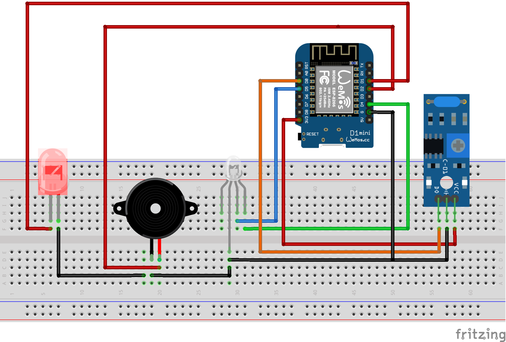

# Projet IOT - Rythmn_hits

The goal of this project is to allow a drummer to train his rythmic accuracy.
It is composed of a metronome, a beat checker and a web interface to check for the accuracy and set the BPM.

## Needed hardware
- Weemos D1 Mini
- RGB LED with common anode
- Passive Buzzer
- SW-420 Vibration sensor

## Installation notes

The wifi code is based of this github repository so, you will need to follow their instructions:
- https://github.com/honnet/iot_intro/wiki/IOT-Intro

## Steps followed
We made the project by following these steps :

- Creating the metronome :
  - Code and hardware :
    - Light on each beat (On a fixed 60BPM beat)
    - Sound on each beat
    - Light on the first beat of a measure
      - IHM
        - get Current BPM
        - set new BPM

- Creating the beat checker
  - Code and hardware :
    - check for beats with vibration sensor
    - check if beats are good or bad
    - blink red led if bad
  - IHM :
    - show number of good beats
    - show number of wrong beats
    - Graphs of beats for 10 last measures

## Breadboard wiring

